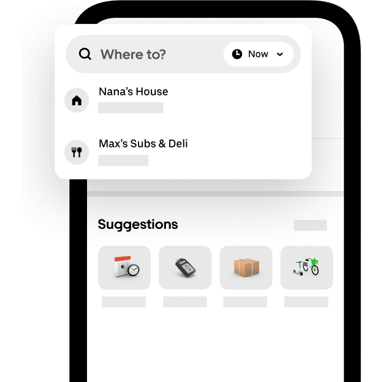
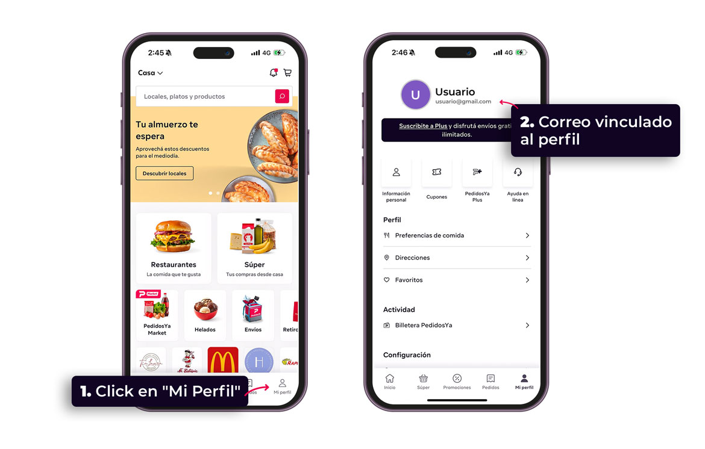

# PymesHub mobile product direction

Updated 2026-09-23. This is the requested direction for the authenticated app;
implementation and verification remain in progress. Marketing keeps its own style.

## External evidence

- [Uber redesigned app](https://www.uber.com/us/en/u/redesigned-uber-app/): prominent search, recurring actions, a service directory and activity destination.
- [Uber announcement, 2023](https://www.uber.com/us/en/newsroom/were-redesigning-the-uber-app-just-for-you/): personalization based on real use. This is a historical reference, not a claim about every current app screen.
- [PedidosYa profile guide](https://plus.pedidosya.com.py/solicitar-visa-joven): public image shows persistent profile navigation, identity at the top, quick actions and grouped settings.
- [Frontend design skill](https://github.com/anthropics/skills/tree/main/skills/frontend-design): intentional typography and restrained, action-driven motion.
- Skill search: `npx skills find mobile design` found `designed-by-ai/skills@design-mobile-apps`, Android/iOS guides from `wshobson/agents`, and mobile UI guides. The first requires a Sleek account/API key; it is not an installed app dependency.
- [Web interface review rules](https://github.com/vercel-labs/web-interface-guidelines/blob/main/command.md): keyboard, focus, forms, motion and touch checks.

Firecrawl branding/screenshot requests failed for insufficient credits. The images
below were downloaded directly from public reference assets and visually inspected;
they are not full-page captures or measured branding-token exports. No external
artwork, identity, or placeholder customer data belongs in the shipped product.

## Adapted visual system

These are PymesHub design choices, not extracted Uber/PedidosYa tokens:

| Role | Direction |
| --- | --- |
| App base | Neutral ink `#111111`; optional light `#F6F6F6` |
| Surface | Dark `#1C1C1C`, light `#FFFFFF` |
| Text | Dark `#F5F5F5`, light `#171717` |
| Secondary text | Dark `#B3B3B3`, light `#595959` |
| Action | Amber `#F59E0B` with dark text; semantic red for errors |
| Type | Existing app sans family; 28–32px page titles, 16px inputs, 14px body, 12px nav |
| Shape | 16–24px grouped surfaces; 12–16px controls; rounded identity avatar |
| Spacing | 4/8/12/16/24/32px rhythm; 16px phone gutters, safe-area insets |
| Interaction | At least 44px targets; short press feedback; reduced motion removes animation |

Use left-aligned titles and clear groupings rather than a desktop dashboard scaled
down. The memorable product element is the action directory for running a business:
conversations, work, customers, documents and billing, filtered by real access.

## Navigation and account

Persistent bottom navigation: Home, Inbox, Tasks, Account, More; permission-restricted
tabs disappear without leaving gaps. More is a bottom sheet containing every other
available feature with text labels. Keep search and workspace context in the header.
Provide keyboard focus containment, Escape/close button and focus restoration.

Account is available to every authenticated user independently of workspace-admin
rights. Group personal information, password, appearance/accessibility and access
information. Use real user/workspace identity. Keep logout in account/menu. Show
pending, successful and failed saves without discarding user input on failure.

## Security, permissions and personalization

- Trace profile, password and upload constraints to their backend DTOs and services.
- Frontend visibility is a convenience; backend authorization remains authoritative.
- Explain role access separately from browser/device permissions. Request camera or
  microphone only when the corresponding feature is used. Never show a fake granted state.
- Persist only presentation preferences locally, scoped to the user/workspace where
  appropriate. No credentials or claims of synchronized settings without an API.
- Support theme selection, readable text and reduced motion. A user preference must
  not override the operating system's reduced-motion request.

## Completion evidence still required

Implemented profile details: uploaded photos use authenticated API requests with
workspace headers; the server checks current workspace membership before serving
them, disables public caching, validates image bytes and stores a bounded WebP
version. A failed database update preserves the previous photo. Legacy extensionless
uploads try JPEG, PNG, then WebP; if several old formats exist, the old schema cannot
identify which was uploaded last. A new upload resolves that ambiguity.

Device access shows actual camera/microphone permission state, observes changes,
and refreshes on return to the page. Unsupported queries show an unknown state;
opening account settings does not request media access. Implementation references:
[Permissions query](https://developer.mozilla.org/en-US/docs/Web/API/Permissions/query),
[permission changes](https://developer.mozilla.org/en-US/docs/Web/API/PermissionStatus/change_event),
and [Sharp image validation](https://sharp.pixelplumbing.com/api-constructor/).

Tasks now use phone cards and a desktop table, API-backed search/pagination with
URL filters, accurate overdue counts, recoverable error states and explicit delete
confirmation. The shared task editor resets for each opening, protects drafts on
dismissal, labels every field and preserves unchanged due timestamps. Optional
assignment/date fields can be cleared. The backend validates assignee membership
and excludes cancelled tasks from pending/overdue summaries.

Home now puts configurable shortcuts before operational counts. Shortcuts are
stored per user/workspace, filtered by the same access rules as navigation, and
remain usable for the current session if browser storage rejects writes. Counts
come from API totals, never the length of a paginated preview. Invoice previews
show the invoice total with its currency; pipeline values are grouped by currency.
Each data section distinguishes loading, absence and failure and offers retry.

Invoices now use mobile cards, currency-labeled balances, server-side search and
URL pagination. Fiscal tools remain available in a disclosure after the list.
Payment entry requires a review step, validates the remaining amount, retains
failed input and restores focus. The list distinguishes API failure from absence.
The API includes every payment when calculating balances and counts, calculates
in cents, and checks invoice permissions after authentication. BILLING can access
invoice operations; administrative approvals remain restricted.

Invoice creation now opens as a bottom sheet on phones with a fixed save footer,
scrollable labeled fields, draft-discard confirmation and retained input after an
API error. Client search is paginated and scoped to invoice permissions; its API
returns only ID, name and company from the authenticated workspace. Product and
CABYS results support keyboard selection, distinguish errors from no results and
ignore stale search responses. Browser reload warns about an unsaved invoice.

Invoice editing now uses the same mobile sheet layout and scoped client picker,
preserves unchanged timestamps, supports clearing optional values and protects
unsaved edits. Existing payments lock currency changes and set the minimum total;
the API checks both constraints before writing. Invalid state transitions are also
rejected before the update transaction. Destructive operations, approvals and
fiscal submission use explicit confirmations that remain open during failures or
pending requests. Credit-note creation includes the required client and lets the
user review its number before creating the draft.

Invoice reminders now open in a mobile sheet with a fixed send footer, explicit
recipient/channel review, draft-discard protection and focus restoration. Generation,
channel-loading and send failures retain the editor and allow retry. Late generation
cannot replace an edited draft or reopen a dismissed sheet. Sending locks controls
against duplicate taps. Only active channels with a matching recipient are offered;
WhatsApp's approved-template behavior is explained separately from email draft text.
The backend now dispatches email through the existing email service, escapes its
HTML representation, uses the outstanding balance in WhatsApp templates and rejects
settled/cancelled invoices and unsupported channels. Provider failures preserve the
unsent reminder and mark the message failed instead of reporting success.

Fiscal guide, validation, error and XML views now fit small screens, use theme-aware
surfaces and readable text, focus their heading on opening and restore trigger focus.
XML supports keyboard scrolling, long unbroken content, downloads and clipboard
failure feedback. Technical error text is no longer silently truncated.

Local verification includes 12 account, 8 task, 6 home and 18 invoice browser tests,
15 profile/storage backend tests, 5 task-service tests, 20 invoice payment/access tests,
10 reminder-service tests and 13 frontend unit tests. These exercise failures and permission
boundaries with test fixtures; they do not replace live API/device verification.

For every mobile feature, verify real API loading/empty/error/success states, role
restrictions, keyboard and screen-reader names, 320/390/768px layouts, zoom/large
text, portrait/landscape, touch targets, safe areas, and reduced motion. Verify profile
updates, password failures, upload errors, session/logout and workspace changes.
The full mobile redesign is not complete merely because home, navigation, tasks and account pass.

Remaining review includes inbox, contacts, invoices, documents, other feature
screens, sidebar modal focus, internal navigation with unsaved edits, session and
server permission coverage, and live API/device checks. Invoice payment/import drafts
and fiscal-tool request recovery still need review. Reminder delivery needs durable
idempotency and reconciliation for ambiguous provider timeouts or database failures
after external acceptance; current unit tests do not prove exactly-once delivery.
WhatsApp conversation history still stores the draft rather than the actual approved
template text; provider acceptance and final recipient delivery are distinct states.
The list currently retrieves full payment
histories for correctness; larger histories need performance measurement. Concurrent
payment registration, multi-currency summary aggregation and the existing 50-line
invoice include limit still require a backend audit. Other controllers need review
for permission checks after JWT authentication; the global permission guard skips
requests before a user is attached.

Current scope is the responsive React app in this checkout. No Flutter app exists
under `apps/`, and the older `L:/PROJECTS/PYMESHUB-MOBILE` location is absent.
