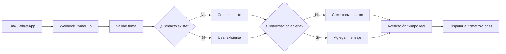

# Inbox unificado

El **Inbox** es el corazón de PymeHub. Centraliza todos los mensajes entrantes de Email y WhatsApp en un solo lugar, permitiendo a tu equipo responder sin cambiar de aplicación.

## ¿Qué es el Inbox?

El Inbox muestra todas las **conversaciones** activas de tu workspace ordenadas por prioridad y fecha. Desde aquí puedes:

- Ver todos los mensajes de clientes en un solo lugar
- Asignar conversaciones a miembros del equipo
- Cambiar el estado y prioridad de cada caso
- Responder directamente sin salir de PymeHub

## Vista del Inbox

Las conversaciones se muestran en una tabla filtrable con:

| Columna | Descripción |
|---|---|
| **Contacto** | Nombre e ícono del canal (Email / WhatsApp) |
| **Asunto / Preview** | Primer línea del mensaje |
| **Asignado a** | Agente responsable |
| **Estado** | Nuevo, Abierto, Pendiente, Resuelto |
| **Prioridad** | Baja, Media, Alta, Urgente |
| **Fecha** | Última actividad |

### Filtros disponibles

- Por **estado**: Nuevo, Abierto, Pendiente, Resuelto, Archivado
- Por **canal**: Email, WhatsApp
- Por **agente asignado**
- Por **prioridad**
- Por **fecha**: hoy, esta semana, este mes

## Detalle de conversación

Al abrir una conversación verás:

### Panel izquierdo — Historial de mensajes
Todos los mensajes ordenados cronológicamente con indicador de dirección (entrante / saliente) y canal de origen.

### Panel derecho — Información del contacto
- Nombre, email, teléfono y tipo de contacto
- Acceso rápido al perfil completo del CRM
- Tareas asociadas al contacto
- Documentos vinculados

### Acciones disponibles

```
[Asignar a] [Cambiar estado] [Cambiar prioridad] [Resolver] [Archivar]
```

**Resolver una conversación:**
1. Haz clic en **"Resolver"**
2. El estado cambia a `RESUELTO`
3. Se registra en el historial del contacto
4. Las automatizaciones de resolución se activan

## Responder mensajes

Para responder a una conversación:

1. Abre la conversación desde el Inbox
2. Escribe tu respuesta en el campo de texto
3. Haz clic en **"Enviar"**

PymeHub envía el mensaje por el mismo canal que usó el cliente (Email → responde por email, WhatsApp → responde por WhatsApp).

### Notas internas

Puedes agregar **notas internas** que solo son visibles para tu equipo:
1. En el campo de texto, selecciona **"Nota interna"**
2. Escribe tu comentario
3. Envía — no será visible para el cliente

## Flujo de un mensaje entrante



## Asignación de conversaciones

Hay dos formas de asignar conversaciones a agentes:

### Manual
En el detalle de la conversación, haz clic en **"Asignar a"** y selecciona el agente.

### Automática (vía Automatizaciones)
Crea una regla que asigne automáticamente conversaciones según el canal, el contacto o el contenido del mensaje.

Ejemplo:
```
Si [mensaje recibido] y [canal = WhatsApp] 
→ Asignar a [Equipo de Ventas]
```

## Prioridades y SLA

Las conversaciones con prioridad **Urgente** aparecen al tope del inbox con un indicador visual rojo.

Puedes configurar automatizaciones para escalar automáticamente la prioridad si una conversación no es atendida en X minutos.

## Notificaciones en tiempo real

PymeHub usa WebSockets para notificarte instantáneamente cuando:

- Llega un nuevo mensaje
- Te asignan una conversación
- Una conversación cambia de estado
- Se crea una nueva conversación en un canal que gestionas

Las notificaciones aparecen en la campanita del menú principal y como alerta en el sistema operativo (app desktop).
