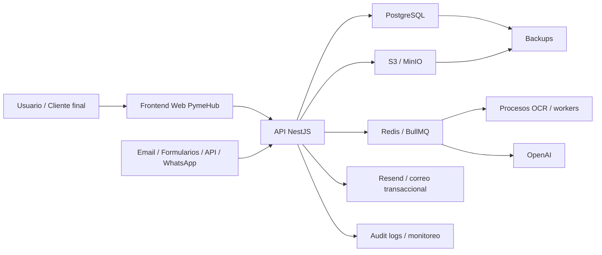

# Flujo de Datos de PymeHub

## 1. Proposito

Este documento describe de manera narrativa y visual como circulan los datos dentro de PymeHub. Su objetivo es servir como referencia de cumplimiento, seguridad y arquitectura para entender puntos de entrada, procesamiento, almacenamiento, transferencia y salida.

## 2. Flujo resumido

PymeHub recibe datos desde usuarios del cliente y desde canales externos. La capa principal de control es la API, que autentica, autoriza, valida el contexto de workspace y coordina persistencia, integraciones, jobs, OCR, IA, notificaciones y logs. Los datos se almacenan en base de datos y storage, y determinadas operaciones se procesan de forma asincrona por workers.

## 3. Puntos de entrada

Las entradas principales de datos son:

- navegacion y acciones del usuario en frontend;
- mensajes y datos provenientes de canales externos;
- carga manual de documentos y adjuntos;
- configuraciones e integraciones del workspace.

## 4. Puntos de procesamiento

Los datos pueden procesarse en:

- API para validacion, autorizacion, persistencia y reglas de negocio;
- workers para tareas asincronas, automatizaciones y OCR;
- servicios de IA para resúmenes, insights o asistencias;
- servicios de correo y notificacion para salida operacional.

## 5. Puntos de almacenamiento

Los principales repositorios de datos son:

- PostgreSQL para datos transaccionales y relacionales;
- S3 o MinIO para documentos y adjuntos;
- Redis o colas para jobs y estado operativo temporal;
- sistemas de logs y monitoreo para observabilidad y evidencia.

## 6. Puntos de salida

Los datos pueden salir del sistema a traves de:

- interfaz del usuario autenticado;
- correos o notificaciones;
- exportaciones autorizadas;
- servicios de terceros para IA, correo, almacenamiento o monitoreo.

## 7. Notas de cumplimiento

- El frontend no debe acceder directamente a datos de otros tenants.
- La API es el punto principal de autorizacion, validacion y scoping por workspace.
- Los workers deben preservar el mismo aislamiento y controles que la API sincronica.
- OCR e IA deben operar con minimizacion de datos razonablemente compatible con la funcionalidad.
