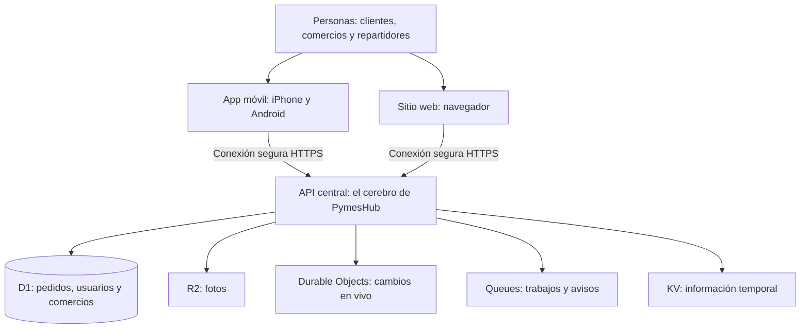
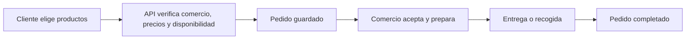

# PymesHub: cómo funcionan la app, la web y la API

> Guía conceptual para personas sin conocimientos técnicos. Basada en el código del repositorio, no es una certificación de disponibilidad en producción.

## Diagrama del sistema

**En pocas palabras:** la app y la web son las puertas de entrada. La API aplica las reglas, comprueba quién puede hacer qué y guarda los pedidos. Los sistemas de Cloudflare guardan información, imágenes y eventos.

## Ejemplo: un pedido

Cada cambio de estado debe validarse en el servidor. La app y la web muestran el mismo pedido; no crean sus propios registros separados.

## Dónde vive cada pieza

| Pieza | Carpeta actual | Tecnología | Explicación |
|---|---|---|---|
| App iOS y Android | `apps/mobile/` | Expo y React Native | Experiencia móvil para clientes, comercios y repartidores |
| Web | `apps/web/` | React y Vite | Experiencia desde el navegador |
| API del marketplace | `packages/trpc-api/` | Cloudflare Workers, Hono y tRPC | Reglas, seguridad y acceso a datos compartidos |
| Datos del marketplace | `packages/db/` | Cloudflare D1 y Drizzle | Tablas y migraciones |
| Autenticación | `packages/auth/` | Better Auth | Gestión de identidad y sesiones |
| Código compartido | `packages/shared/` | TypeScript | Reglas y tipos compartidos |
| API antigua | `apps/api/` | NestJS y Prisma | Código legado del SaaS; **no** es la API principal del marketplace |

## Qué se puede afirmar y qué falta comprobar

- **Existe código para móvil, web, API y base de datos.** La presencia del código no prueba que cada flujo funcione en un dispositivo real.
- **Hay un workflow de validación** en `.github/workflows/release-gate.yml` que contempla migraciones D1, API, web y móvil. Para afirmar «listo para lanzar» hay que verificar resultados verdes del commit que se vaya a distribuir.
- **La app tiene configuraciones de compilación y distribución** en `apps/mobile/eas.json`; hace falta probar versiones concretas de Android e iOS.
- **Hay dos backends en el monorepo.** Para nuevas funcionalidades del marketplace utilizar `packages/trpc-api/`, salvo decisión explícita de migración.

## Checklist de lanzamiento (pendiente de evidencia)

- [ ] Confirmar CI verde del commit exacto de lanzamiento.
- [ ] Ejecutar tests y comprobación de tipos de la app, API y web.
- [ ] Instalar y probar la aplicación en dispositivos iOS y Android reales.
- [ ] Probar inicio de sesión, descubrimiento, carrito, creación de pedido y todas las transiciones del pedido.
- [ ] Probar desconexión móvil, reintentos, pedidos duplicados, fallos en servicios y recuperación.
- [ ] Verificar control de permisos: cliente, comercio, repartidor y administrador.
- [ ] Verificar despliegues y bindings de producción sin modificarlos automáticamente.
- [ ] Realizar un pedido completo de prueba con un comercio y repartidor reales (entorno controlado).

## Precaución operativa importante

`wrangler.toml` (raíz) advierte que publicar manualmente el Worker web puede competir con el despliegue automático de Cloudflare y dejar el sitio sin cargar scripts JavaScript. Revisar el procedimiento documentado antes de cualquier despliegue. El archivo `packages/trpc-api/wrangler.toml` también exige seleccionar explícitamente el entorno de producción; no ejecutar un despliegue genérico.

Fuentes dentro del repositorio: `README.md`, `apps/mobile/package.json`, `apps/mobile/eas.json`, `apps/web/package.json`, `packages/trpc-api/package.json`, `packages/trpc-api/wrangler.toml`, `wrangler.toml`, `.github/workflows/release-gate.yml`.
